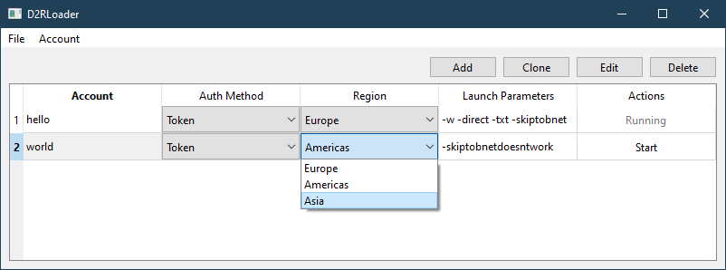

# Diablo 2 Resurrected Loader

This is a simple Qt app which manages starting multiple Diablo 2 Resurrected instances.

Be warned, it's still got a couple of rough edges.

Its heavily inspired by <a href="https://github.com/shupershuff/Diablo2RLoader">shupershuff/Diablo2RLoader</a>. Check this repo out if you want to learn more about multiboxing D2R :-)

The basic stuff works for launching multiple instances but I have a couple of features in mind that I want to implement:

- A distributable exe/zip
- Linux/Wine Support (main reason to write this in Python; not sure how feasible this is due to the token generation with pywin32/Windows DBAPI
- TZ/DClone Tracker
- aaand maybe something like the settings switcher from Diablo2Loader (lets see how much spare time I have for gaming and coding after winter is over)

# How To Run This

1. Make sure [Python](https://python.org) is installed
2. Make sure [uv](https://docs.astral.sh/uv/) is installed
3. Download handle64.exe (TODO: Lets automate this)
4. Open a terminal as Administrator (otherwise you can't kill those nasty handles)
5. ``uv run d2rloader``
6. Check it out and configure it properly via the GUI :)

# License

MIT License
