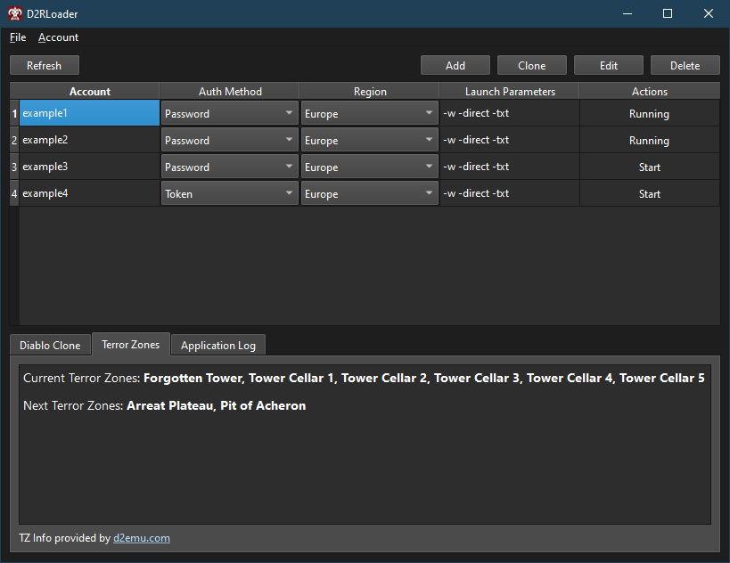
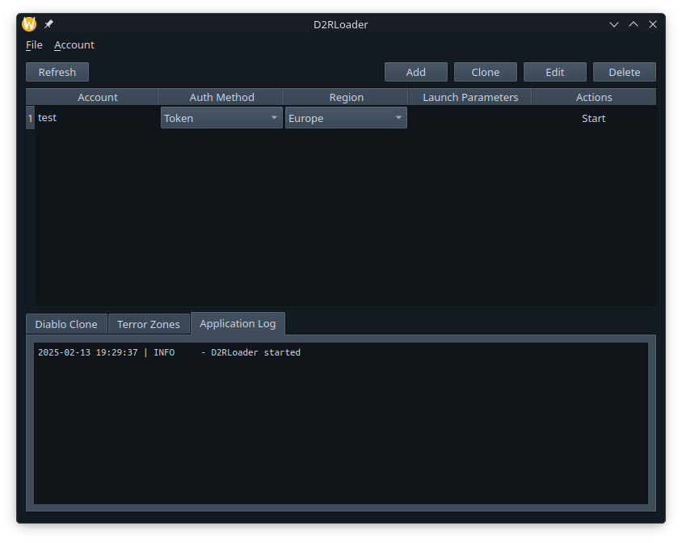

# Diablo 2 Resurrected Loader

This is a simple Qt app which manages starting multiple Diablo 2 Resurrected instances.

Its heavily inspired by <a href="https://github.com/shupershuff/Diablo2RLoader">shupershuff/Diablo2RLoader</a>. Check this repo out if you want to learn more about multiboxing D2R :-)

Running on Windows

Running on Linux

# Getting Started

D2RLoader supports Windows and Linux through Wine. Although for Linux support you also have to install [Lutris](https://lutris.net).
For the TZ Info and DClone Info to work you have to request an API key from d2emu.com. I am working with d2emu.com to make this Loader
work without a user specified API key.
Another note for Linux: Only Password-auth is supported. Token-auth doesn't work due to the way the tokens are protected using the Windows DBAPI.
Also, I have only tested my Linux environment (Arch Linux). So, if you find any issues with yours, please report them so I can get them fixed!

If you try to login via Password-auth and get an error like  "We couldn't verify your account with that information", try changing your password and retry again. This worked for me at least.

All configuration files are stored in ``%APPDATA%/d2rloader`` on Windows or ``$XDG_CONFIG_DIRS/d2rloader`` on Linux

## Windows

1. Download the latest "D2RLoader.windows.zip" from the releases page here and extract it.
2. Download handle64.exe - You can use [this](https://download.sysinternals.com/files/Handle.zip) link.
3. Create a desktop shortcut and configure it to run as **Administrator**. Admin rights are unfortunately needed to kill the handles.
4. Start D2RLoader.exe and configure the handle.exe path and D2R game folder (File -> Settings)
5. Create and configure a new account by pressing "Add".
6. Start the game with the configured account.

## Linux

- Install Lutris (i.e. via your package manager ``pacman -S lutris``)
- Search for Diablo 2 Resurrected on Lutris and install it. This will install the Battle.NET app.
- Install Diablo 2 Resurrected from the Battle.NET app. Tipp: If you have D2R already installed on Windows you can just copy it to your preferred location and point to it from the Battle.NET app.
- Handle64.exe is not needed on Linux as we are working with different WINEPREFIXES to solve this problem :-)
- Select your prefered WINEPREFIX location otherwise a default one will be set to $XDG_CONFIG_DIRS/d2rloader/wineprefixes.

# Planned Features

- Minimize to system tray
- Settings switcher (per account game settings)
- Provide a package for Linux

# License

MIT License
