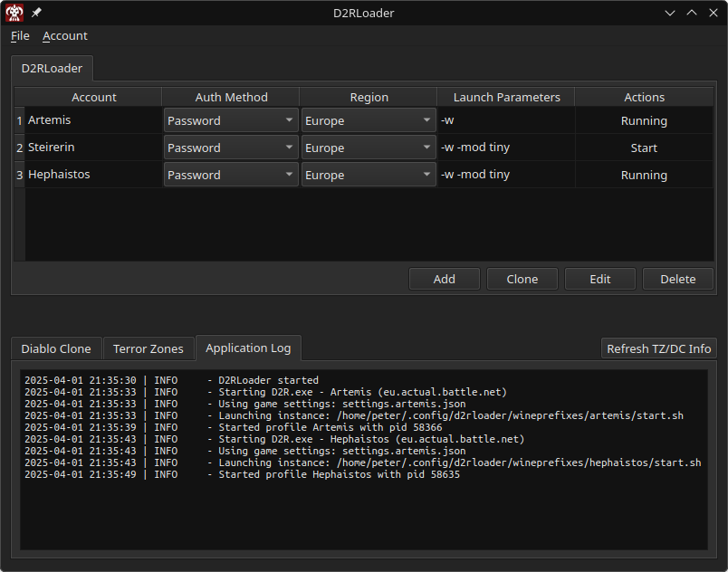

# Diablo 2 Resurrected Loader

This is a simple Qt app which manages starting multiple Diablo 2 Resurrected instances.

Its heavily inspired by <a href="https://github.com/shupershuff/Diablo2RLoader">shupershuff/Diablo2RLoader</a> - a powerful PowerShell CLI solution for multiboxing D2R with even more features than this loader. Check this repo out if you want to learn more about multiboxing D2R :-)

Running on Windows

Running on Linux

# Getting Started

D2RLoader supports Windows and Linux (via Wine/[Lutris](https://lutris.net)).

I have only tested my Linux environment (Arch Linux) so far. So, if you find any issues with yours, please report them so I can get them fixed!

The TZ Info and DClone Info require a working API key from [d2emu.com](https://d2emu.com).

All configuration files are stored in ``%APPDATA%/d2rloader`` on Windows or ``$XDG_CONFIG_DIRS/d2rloader`` on Linux

## Windows

- Download the latest "D2RLoader.windows.zip" from the [releases page](https://github.com/sh4nks/d2rloader/releases) and extract it.
- Create a desktop shortcut and configure it to run as **Administrator**. Admin rights are unfortunately needed to kill the handles.
- Start D2RLoader.exe and configure the handle.exe path and D2R game folder (File -> Settings)
- Create and configure a new account by pressing "Add".
- Start the game with the configured account.

## Linux

- Download the provided [**AppImage**](https://github.com/sh4nks/d2rloader/releases) from the release page and make it executable.
  - In case you are using Arch Linux you can use your favorite AUR helper to install [d2rloader](https://aur.archlinux.org/packages/d2rloader) from the AUR.
- Install Lutris (Note: When using my AUR Package you don't have to install Lutris anymore as it will be installed as well)
- Search for Diablo 2 Resurrected on Lutris and install it. This will install the Battle.NET app.
- Install Diablo 2 Resurrected from the Battle.NET app. Tipp: If you have D2R already installed on Windows you can just copy it to your preferred location and point to it from the Battle.NET app.
- Handle64.exe is not needed on Linux as we are working with different WINEPREFIXES to solve this problem :-)
- Select your prefered WINEPREFIX location otherwise a default one will be set to $XDG_CONFIG_DIRS/d2rloader/wineprefixes.

## Auth Methods

You can choose between 2 auth methods. However, the token authentication is more robust and allows one to use MFA.

### Password

Deactivate your Battle.net Authenticator for your account because passing passwords via parameters won't work with Multi-Factor Authentication (MFA).

If you try to login using password authentication and get an error like  _"We couldn't verify your account with that information"_, try changing your password and try again. This worked for me at least.

**On Linux only this authentication method is supported**. The reason for this is that the tokens are protected using the proprietary Windows DBAPI which isn't available on Linux/Wine.

### Token

This method works with Multi-Factor Authentication!

1. Open a browser in private mode
2. Navigate to https://us.battle.net/login/en/?externalChallenge=login&app=OSI
3. Log in to your account
4. You will be redirected to an unknown (localhost) page.

    For Chrome-based browsers:

    - Your URL will look something like this:
    http://localhost:0/?ST=US-c099c810-2b2c-42b6-8bd0-ae6735d54510&flowTrackingId=37f670de-7831-4b32-9cb5-2a219e9eea4a

    - Copy the part from ``US-c099c810-2b2c-42b6-8bd0-ae6735d54510&`` and paste it in your Account settings

    For Firefox you have to open the console (F12) and go to _Storage_ -> _Cookies_ and copy the **value** from the ``gs.id`` cookie

## Game Performance Improvements

- Skip Intro (``-skiptobnet`` doesn't work anymore...)

  https://www.nexusmods.com/diablo2resurrected/mods/194

- TinyMod (replaces HD textures to lower memory usage)

  https://github.com/D2R-Gimli/TinyMod

# D2RLoader Plugins

If you are interested in developing a plugin for D2RLoader, take a look at the [Plugin Documentation](./PLUGINS.md)

# License

MIT License
